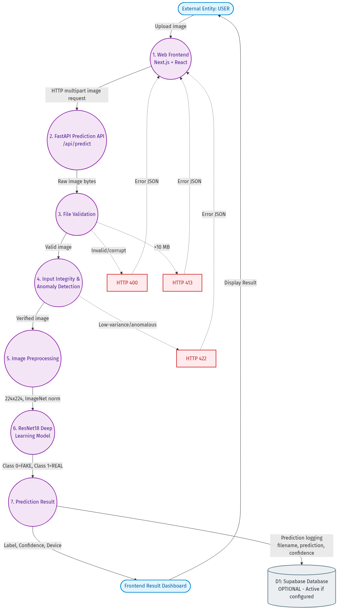

# Data Flow Diagram (DFD)

## DFD Description
The Data Flow Diagram illustrates the exact movement and transformation of data through the DefendAI application. It highlights external entities, data stores, distinct processing stages, and error-handling branches.

## Process Explanations and I/O Data

### 1. Web Frontend (Next.js + React)
- **Description**: The user interface where clients interact with the application.
- **Input**: User uploads an image via drag-and-drop or file selection.
- **Output**: HTTP `multipart/form-data` request containing the raw image bytes.

### 2. FastAPI Prediction API
- **Description**: The backend API router (`/api/predict`) that receives the request.
- **Input**: HTTP multipart image request.
- **Output**: Extracted raw image bytes ready for processing.

### 3. File Validation
- **Description**: Initial integrity check ensuring the payload is safe and compatible.
- **Input**: Raw image bytes.
- **Output**: A valid, parsed image object, or an error trigger.
- **Error Handling**: 
  - If the file is corrupt or invalid format → **HTTP 400 (Bad Request)**.
  - If the file size exceeds 10 MB → **HTTP 413 (Payload Too Large)**.

### 4. Input Integrity & Anomaly Detection
- **Description**: Security layer designed to filter out anomalous images (like completely uniform blocks of color).
- **Input**: Valid image object.
- **Output**: Verified image object.
- **Error Handling**: 
  - If standard deviation is extremely low (anomalous) → **HTTP 422 (Unprocessable Entity)**.

### 5. Image Preprocessing
- **Description**: Standardizes the image for the deep learning model.
- **Input**: Verified image object.
- **Output**: A PyTorch tensor (Resized to 224x224 and ImageNet normalized).

### 6. ResNet18 Deep Learning Model
- **Description**: The core inference engine running PyTorch.
- **Input**: Preprocessed image tensor.
- **Output**: Raw logits and softmax probabilities mapped to `Class 0 = FAKE` and `Class 1 = REAL`.

### 7. Prediction Result
- **Description**: Structures the model's numerical output into a readable response.
- **Input**: Class probabilities.
- **Output**: A JSON payload containing the string Label (`REAL` or `FAKE`), Confidence Score (%), and Processing Device (e.g. `cpu` or `cuda:0`).

## Frontend Result Dashboard
- **Description**: Parses the final JSON response from the backend and visually displays the Verdict and Confidence to the User.

## Optional Data Store (Supabase)
- **Description (D1)**: If credentials are provided in the environment variables, the system logs inference metadata for monitoring.
- **Input**: Prediction Result data (filename, prediction label, confidence score).
- **Note**: This is strictly OPTIONAL and seamlessly bypassed if credentials are not configured.
