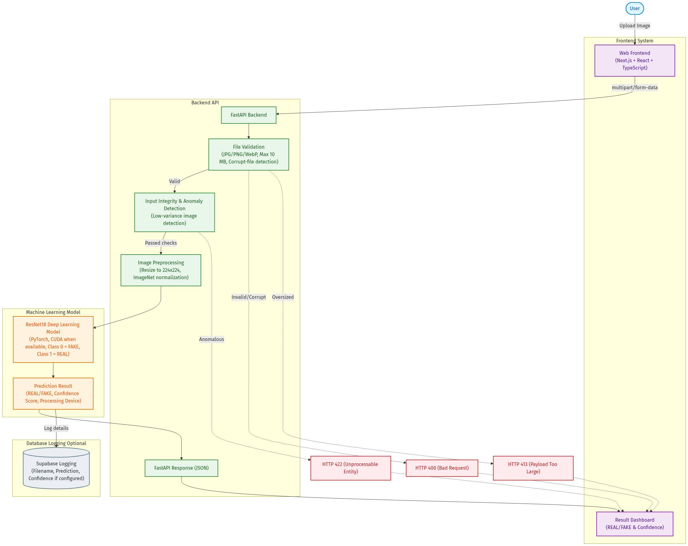

# System Architecture

DefendAI is composed of a decoupled frontend and backend:

- **Frontend**: A Next.js/React application providing a user interface for drag-and-drop image uploads, loading states, error handling, and visual displays for prediction results and confidence scores.
- **Backend**: A FastAPI application exposing endpoints (`/ready` and `/api/predict`).
- **Model Storage**: Trained weights are loaded locally from the file system.

## System Architecture Diagram

The diagram above visually outlines the DefendAI pipeline:
1. **User Interaction**: Users upload images via the Next.js React frontend.
2. **Backend Validation**: The FastAPI backend intercepts the request and strictly enforces format (.jpg, .png, .webp) and size limits (10MB max). Invalid or corrupt images return HTTP 400 or HTTP 413.
3. **Security Check**: An Input Integrity and Anomaly Detection filter verifies the standard deviation of pixel values. Low-variance (anomalous) inputs are immediately rejected with an HTTP 422 error.
4. **Machine Learning Pipeline**: Valid images are resized (224x224) and normalized for the PyTorch-based ResNet18 model, which predicts if the image is FAKE (0) or REAL (1).
5. **Database Logging**: The pipeline conditionally logs metadata (predictions and confidences) to Supabase if configured.
6. **Response**: Final classification details are returned as JSON and rendered on the frontend dashboard.
